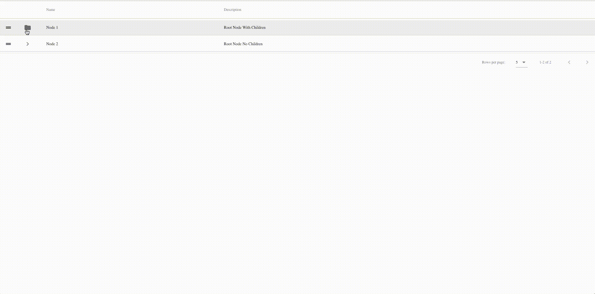

# Vuetify Tree Data Table



Tree functionality added to the Vuetify Data Table. Supports DnD sorting and moving nodes to new parents.

You must have Vuetify loaded to use this component.

# Usage

## NPM

```
npm install v-tree-data-table
```

## Yarn

```
yarn add v-tree-data-table
```

To use simply register the component with Vue

```
import TreeDataTable from 'v-tree-data-table';
Vue.component('v-tree-data-table', TreeDataTable);
```

## Props

| Prop             | Type              | Required | Usage                                                                                                                                                                                                                      |
| ---------------- | ----------------- | -------- | -------------------------------------------------------------------------------------------------------------------------------------------------------------------------------------------------------------------------- |
| headers          | Array             | Yes      | Headers for the v-data-table                                                                                                                                                                                               |
| items            | Array             | Yes      | items for the v-data-table, should contain tree data. (expanded, children, loaded, depth)                                                                                                                                  |
| pagination       | Object            | Yes      | Pagination object for the v-data-table                                                                                                                                                                                     |
| totalItems       | Number            | Yes      | total-items for v-data-table                                                                                                                                                                                               |
| loading          | Boolean           | Yes      | If the data is being loaded                                                                                                                                                                                                |
| rowsPerPageItems | Array             | No       | Passed through to for v-data-table                                                                                                                                                                                         |
| rowsPerPageText  | String            | No       | Passed through to for v-data-table                                                                                                                                                                                         |
| selectAll        | [Boolean, String] | No       | select-all for v-data-table                                                                                                                                                                                                |
| validDrop        | Function          | No       | Function that returns true or false if it is a valid drop. |

## Emits

### dblclick

When a row is double clicked

#### Arguments

event - Browser event<br/>
node - Node that was clicked

### contextmenu

Mouse right click

### Arguments

event - Browser event<br/>
node - Node that was clicked

### load

Called when the data should be reloaded into the items property

#### Arguments

pagination - Pagination data from v-data-table

### input

When a row is selected

#### Arguments

selected - Selected Node

### drop

When a node is dropped

#### Arguments

node - Node that was dropped<br/>
oldParent - The previous parent of the node<br/>
parentNode - The new parent of the node<br/>
previousSibling - The previous sibling of the node<br/>
nextSibling - The next sibling of the node<br/>
nodes - All nodes<br/>
revert - Function to revert drop<br/>

### node-toggle

When a node is toggled

#### Arguments

node - Node record that was toggled

## Example

To run the example, simple clone down repo and open index.html in a browser.

# License

Tree Data Table is open-sourced software licensed under the MIT license.
